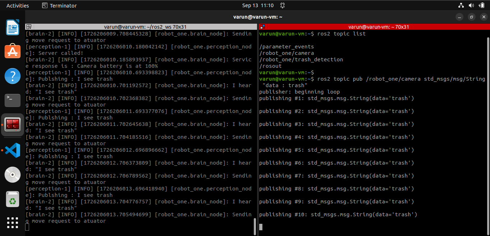

# trash-picking-robot

## Overview
The Trash Collecting Robot is designed to identify trash using camera input, process the information, and direct the robot's movement accordingly. Instead of full-fledged computer vision, the system uses mocked image data ("trash image" or "no trash image") sent as strings on the camera topic. The robot's perception node processes these strings, and if trash is detected, it sends a command to the brain node, which then moves the robot.

## Features
- Simplified perception using mocked camera input.
- Custom ROS 2 interface for component status.
- Modular design with separate nodes for perception and decision-making (brain).
- Service-based communication for component status monitoring.
- Extendable to real computer vision applications.

## System Architecture
The system consists of two main nodes:

- **Perception Node**: Subscribes to the camera topic, identifies if trash is present, and publishes detection results.
- **Brain Node**: Subscribes to the detection results from the perception node and decides whether to command the robot's actuator.

## Packages
### 1. custom_interfaces
This package contains custom ROS 2 interfaces for the project.

- Service: `ComponentStatus.srv`
    - `Request`: string component
    - `Response`: string status

### 2. perception
Handles perception tasks by reading mocked camera input and publishing detection information.

  - Node: `perception_node`
  - Topics:
          - Subscribes to: `/camera` (String)
          - Publishes to: `/trash_detection` (String)
  - Services:
          - Provides: `/component_status` (ComponentStatus)
### 3. brain
The brain of the robot, responsible for decision-making based on perception input.

  - Node: `brain_node`
  - Topics:
      - Subscribes to: `/trash_detection` (String)
  - Services:
      - Calls: `/component_status` (ComponentStatus)

  ## Installation
  1. Clone this repository:
  ```
  git clone https://github.com/Varun-Ajith/trash-picking-robot.git
  cd trash-picking-robot
  ```
  2. Build the workspace:
  ```
  colcon build
  source install/setup.bash
  ```
  ## How to Run
  1. **Launch the robot**: Use the provided launch file to start both the perception and brain nodes:
  ```
  ros2 launch launchfile robot.launch.py
  ```
  2. **Publish mock data on camera topic**: Simulate camera input by publishing to the `/robot_one/camera` topic:
  ```
  ros2 topic pub --once /robot_one/camera std_msgs/String "data: trash"
  ```
  3. **Check outputs**: Monitor the `/robot_one/trash_detection` topic and brain node logs to verify the correct detection and decision-    making processes.

  ## Testing
  - **Perception Node**:
  Test by publishing "trash" and "no trash" on the `/camera` topic and verify output on `/trash_detection`.
  - **Brain Node**:
  Check if the brain node correctly logs actions based on detection messages.
  ## Future Work
  - Implement actual computer vision processing for trash detection.
  - Integrate with real robotic hardware for actuator control.
  - Expand perception capabilities to detect different types of trash.
  ## Contributing
  Contributions are welcome! Please fork this repository, make your changes, and submit a pull request.
  ## License
  This project is licensed under the [Apache License](LICENSE) - see the LICENSE file for details.

  

